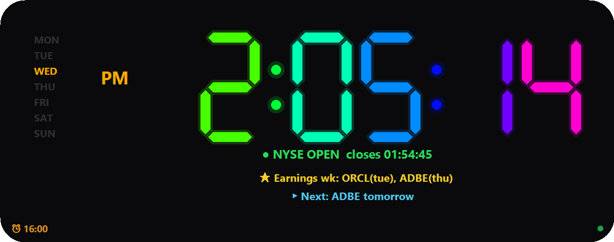

# 🕒 BetaClock — always-on-top LED trading clock for Windows

**An always-on-top LED desktop clock, built for trading.** Native Windows app (C#/WinForms), a single ~114 KB `.exe` with no dependencies and no installer. Accurate time (NTP), market session, holidays, earnings for your watchlist, alarms, 6 languages and skins — floating over your trading platform without ever stealing its focus.



---

## ⬇️ Download

Grab `BetaClock.exe` from the [latest release](../../releases/latest). There is no
installer: drop it anywhere and double-click it.

```
SHA-256  6a9fbd027c0874d7a3c6fdf02c7a95ead0ddaabcca65ac8b326ee254943fccff
```

**Windows will warn you the first time.** The binary is not code-signed, so
SmartScreen shows *"Windows protected your PC"*. Click **More info** → **Run
anyway**. Two more things worth knowing before you decide to trust it:

- **An antivirus may flag it heuristically.** Look at the profile: a small
  unsigned executable that opens UDP sockets (NTP), makes HTTPS requests
  (earnings) and — only if you switch on "Start with Windows" — writes one value
  under `HKCU\...\Run`. To a heuristic that reads like malware, even though every
  one of those is a documented feature whose source is right here in this repo.
- **The build is not reproducible.** The in-box C# compiler stamps a fresh
  identifier and timestamp on every compile, so rebuilding will *not* give you the
  same hash. The SHA-256 above tells you your download arrived intact — it does
  not prove the binary came from this source. If you would rather not trust a
  binary at all, [build it yourself](#-build): it is one command and needs nothing
  installed.

---

## ✨ Features

- **7-segment LED clock** HH:MM:SS drawn by hand with GDI+, draggable, always on top, and it never steals focus from your trading platform (`WS_EX_NOACTIVATE` overlay).
- **11 color modes**: 8 solid + RGB gradient + animated RGB + a **"Candlesticks" skin** (every segment is a green/red candle — the AM/PM too).
- **Internet time (NTP/SNTP)** — shows how far your PC clock runs fast or slow.
- **NYSE market session**: PRE-MARKET / OPEN / AFTER-HOURS / CLOSED / HOLIDAY plus a countdown to the open or close. Also a **Forex** mode (Sydney/Tokyo/London/NY).
- **NYSE holidays** computed by rule for any year (Good Friday included) + 1pm early closes + an **advance notice** ("⚠ Tomorrow is a holiday: …").
- **Earnings** for your watchlist: what reports this week and what's next (date, BMO/AMC, countdown). Free source, **no API key** (Nasdaq's public calendar).
- **Alarms** with looping sound, a flashing alert, snooze, and market open/close presets.
- **Day of week, date, AM/PM, opacity, brightness, size, glow, digit shadow** — all configurable.
- **6 languages**: English (base), Spanish, Portuguese (BR), German, French, Simplified Chinese. Auto-detected from Windows, with a manual selector.
- **Its own icon**, a desktop shortcut, and optional start with Windows.

---

## 🖱️ Usage

- **Double-click** `BetaClock.exe` (or the desktop shortcut) to launch.
- **Drag** with the mouse to move it; **mouse wheel** to resize.
- **Right-click** (on the clock or the tray icon) → menu with every option:
  - **Color** (including the candlestick skin), Brightness, Size, Opacity
  - 24h format, seconds, day, date, AM/PM, digit shadow, glow
  - **Market session** (US / Forex), **Earnings** (edit tickers / refresh)
  - **Alarms…**, **Idioma / Language**, Always on top, Lock position, Start with Windows
  - About, Center, Exit
- **Arrow keys** move it 1 px (Shift = 10 px).

---

## 📁 Project files

No file goes over 300 lines. `ClockForm` is split across several `partial class`
files, which the compiler merges back into one class — so each concern lives on
its own without any indirection at runtime.

| File | What it is | Lines |
|---|---|---|
| `Program.cs` | Entry point, single instance, DPI awareness | 74 |
| `ClockForm.cs` | Main window: state, startup, current time | 175 |
| `ClockForm.Window.cs` | Placement, sizing, mouse and keyboard | 234 |
| `ClockForm.Drawing.cs` | Painting the clock face and color modes | 191 |
| `ClockForm.Digits.cs` | Low-level 7-segment and candlestick drawing | 227 |
| `ClockForm.Market.cs` | Market sessions, NYSE holidays, Forex | 271 |
| `ClockForm.Earnings.cs` | Earnings fetch, cache and display lines | 246 |
| `ClockForm.Alarms.cs` | Alarm scheduling, sound and firing | 230 |
| `ClockForm.Menu.cs` | Context menu (right-click and tray) | 218 |
| `ClockForm.Ntp.cs` | SNTP time synchronization | 103 |
| `ClockForm.System.cs` | Start with Windows, tray icon, shutdown | 95 |
| `Settings.cs` | Persistent settings (`key=value` file) | 157 |
| `Models.cs` | `Alarm` and `EarningEvent` | 77 |
| `JsonParser.cs` | Minimal dependency-free JSON parser | 110 |
| `AlarmManagerForm.cs` | Alarm manager dialog | 204 |
| `AlarmAlertForm.cs` | Alarm alert popup | 124 |
| `EarningsForm.cs` | Earnings panel dialog | 145 |
| `AboutForm.cs` | About dialog | 109 |
| `BetaClockI18n.cs` | Translation system (`Tr`, 6 languages, English base) | 282 |
| `build.ps1` | Build script (compiles every `.cs` in the folder) | — |
| `make_icon.ps1` | Regenerates `clock.ico` | — |

**User settings:** `%APPDATA%\BetaClock\settings.cfg` (plain `key=value` format).
**Earnings cache:** `%APPDATA%\BetaClock\earnings.cache`.

---

## 🔨 Build

Nothing to install — it uses the C# compiler that already ships with Windows (.NET Framework). Just run in PowerShell:

```powershell
.\build.ps1
```

Or manually:

```powershell
& "C:\Windows\Microsoft.NET\Framework64\v4.0.30319\csc.exe" `
    /noconfig /nologo /codepage:65001 /target:winexe /optimize+ `
    /win32icon:clock.ico /out:BetaClock.exe `
    /r:System.dll /r:System.Core.dll /r:System.Drawing.dll /r:System.Windows.Forms.dll `
    BetaClock.cs BetaClockI18n.cs
```

> ⚠️ **Close the app before rebuilding** (it locks the `.exe`): `Stop-Process -Name BetaClock`.
> ⚠️ **Always pass `/codepage:65001`** or Chinese renders as empty boxes.

---

## 🌍 Adding a language or a new string

> The **base language of the code is English**: the English literal IS the dictionary key, and Spanish is just another translation.

1. In `BetaClock.cs`, wrap the English literal with `Tr.T("...")`.
2. In `BetaClockI18n.cs`, inside `EnsureInit()`, add a row:
   ```csharp
   A("english", "español", "português", "deutsch", "français", "中文");
   ```
   (the key must match **exactly**; with no row, the English key itself is shown).
3. For a new language: add its code to `Codes`/`Names`, a row to each calendar array (`DAYSTRIP`, `DOWUP`, `DOWSHORT`, `DOWFULL`, `MON`, `FX`), and one column to every `A(...)`.
4. ⚠️ Two different strings **cannot share an English key** — they would collide in the dictionary. That is why the digit-shadow level is `Moderate` and not `Medium`, which the "Mediano" size already uses.

---

## 📊 Earnings — how it works

- Source: **Nasdaq's public earnings calendar** (`api.nasdaq.com/api/calendar/earnings?date=…`), free and with no account or API key.
- Downloaded **once a day** in a background thread: one request per business day in the range (≈20-30 requests — the count does NOT depend on how many tickers you follow), then cached.
- Edit your ticker list from the menu → **Earnings: tickers / refresh…**
- Resilient: if the network fails it keeps the good data and the cache, and retries later.
- The request sends a browser `User-Agent`, which the endpoint requires. This is an undocumented public endpoint: it can change or rate-limit at any time, and you are responsible for complying with Nasdaq's terms of use.

---

## 🕯️ The "Candlesticks" skin

Every bar of the 7-segment digit is drawn as a **candlestick** (body + wicks). Green = up, red = down; the color is deterministic per position, so it never flickers. The **AM/PM** is drawn with candles too.

---

## 🔒 Notes on privacy and network

- BetaClock makes **exactly two kinds of outbound connection**: SNTP over UDP/123 to public time servers, and HTTPS to `api.nasdaq.com` for the earnings calendar. Nothing else.
- **No telemetry, no analytics, no accounts, no API keys.** Your ticker list never leaves your machine: earnings are fetched per DAY for every company and filtered locally.
- Settings and cache live only in `%APPDATA%\BetaClock\`.
- "Start with Windows" writes a single value under `HKCU\...\Run` and removes it when you turn the option off. No admin rights are ever required.
- The NTP offset is sanity-checked (server-mode reply, valid stratum, and rejected beyond ±24 h) so a hostile reply on your network cannot silently shift the clock.

---

## 🛠️ Technical gotchas already solved (read before patching)

- **C# 5 compiler**: the in-box `csc` supports no `$"…"` interpolation, no `?.`, no `nameof`, no auto-property initializers. `Timer` is ambiguous → use `System.Windows.Forms.Timer`. `NumericUpDown` has no `Wrap`.
- **Multi-monitor DPI**: use **Per-Monitor-V2** (`SetProcessDpiAwarenessContext(-4)`) + `AutoScaleMode.None`. Dragging uses the **native drag** (`WM_NCLBUTTONDOWN`) so the window does not "fly" off-screen between monitors with different scaling.
- **Dialogs**: fonts in **pixels** (`GraphicsUnit.Pixel`) + `AutoScaleMode.None`, or text gets clipped on 150% monitors.
- **Chinese**: build with `/codepage:65001`.
- **The menu would not change language**: the `Opening` event does not fire reliably on this focus-less overlay window, so `PopulateMenu()` is forced from `ApplySave()` (coalesced via `BeginInvoke`).
- To verify visually on multi-monitor, capture the **entire virtual desktop** — cropping by coordinates lands on the wrong window because of the DPI mismatch.

---

## 📄 License

MIT — see [LICENSE](LICENSE).

*BetaClock · built with Claude Code.*
